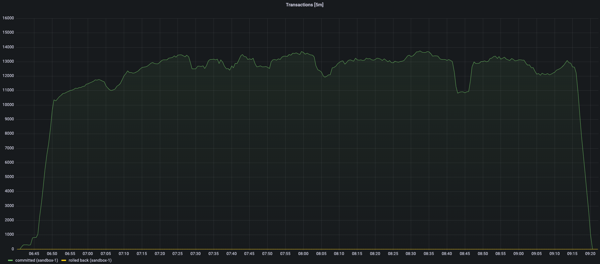
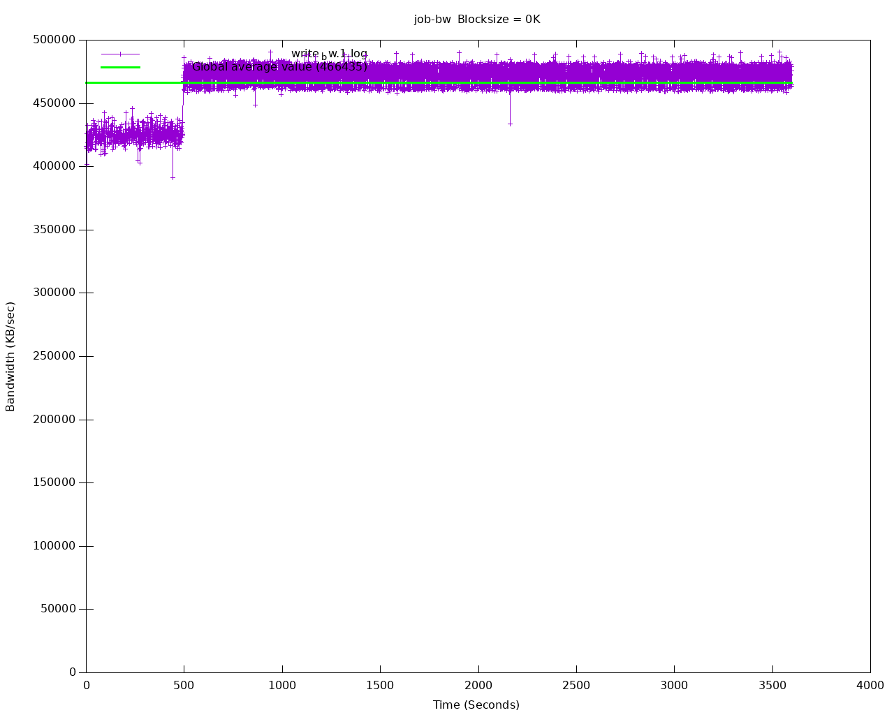

# Benchmarking Cloud Native PostgreSQL

`cnp-bench` provides a bundle of helm charts designed for benchmarking a PostgreSQL deployment in Kubernetes,
in a controlled, non-production environment. This guide is currently designed and tested to run `cnp-bench`
on a [Cloud Native PostgreSQL (CNP)](https://docs.enterprisedb.io/) Cluster by [EDB](https://enterprisedb.com/).

Benchmarking is focused on two aspects:

- the **storage**, by relying on [fio](https://fio.readthedocs.io/en/latest/fio_doc.html)
- the **database**, by relying on either [pgbench](https://www.postgresql.org/docs/current/pgbench.html),
  PostgreSQL's default benchmarking application, or [HammerDB](https://www.hammerdb.com/docs/).

**IMPORTANT:** `cnp-bench` must be run in a staging or pre-production
environment. Do not use `cnp-bench` in a production environment, as it
might have catastrophic consequences on your databases and the other
workloads/applications that run in the same shared environment.

## Requirements

* A running Kubernetes cluster;
* A working connection to the Kubernetes cluster via `kubectl`;
* Helm should be installed locally (see the
  ["Installing Helm" documentation page](https://helm.sh/docs/intro/install/));
* Access, within Kubernetes, to the PostgreSQL cluster you want to benchmark.

As far as the latter is concerned, you might need to install the CNP operator
if you are planning to run benchmarks on disposable Postgres clusters that
exist for the sole duration of the test.
Consider that, if you install
[cnp-sandbox](https://github.com/EnterpriseDB/cnp-sandbox), the CNP operator
will be installed together with the monitoring stack comprising Grafana,
Prometheus and default metrics. This is our recommended approach.

## Installing the `cnp-bench` Helm charts

First, you need to clone the main repository:

```
git clone git@github.com:EnterpriseDB/cnp-bench.git
cd cnp-bench
```
You can install a chart by defining a "Release Name" that will be used to
identify the resources and running:

``` sh
helm install RELEASE_NAME path/to/chart/dir
```
Please note that each benchmark is managed by a different chart that is located in a different folder.

For example, to run the `fio` benchmark, you need to install the chart located in the `fio-benchmark` folder.
Please refer to the specific sections below for details on each scenario.

You can override the default settings included in the `values.yaml` file of a chart using the `--values` or `--set` options of `helm install` or
by passing the whole yaml configuration file with the`--values` argument.
You can obtain a configuration file by copying the values.yml contained in your chosen chart and use it as a starting point.
More details are available in the [Helm install documentation](https://helm.sh/docs/helm/helm_install/#helm-install).
See the `README.md` file included in each chart for the available parameters.

You can verify the installed helm charts with:

``` sh
helm list
```

Resources created by a chart can be removed running:

``` sh
helm uninstall RELEASE_NAME
```

## Installing `cnp-sandbox`



`cnp-sandbox` will deploy in your selected Kubernetes cluster Prometheus,
Grafana, CNP, as well as a sample dashboard for Granana based on
a sample set of metrics exposed by CNP Clusters.

For more information, please refer to the [main Github repository of
`cnp-sandbox`](https://github.com/EnterpriseDB/cnp-sandbox).

## Benchmarking the storage with `fio`

The chart is contained in the `fio-benchmark` directory.

It will:

1. Create a PVC;
1. Create a ConfigMap representing the configuration of a fio job;
1. Create a fio deployment composed by a single Pod, which will run fio on
   the PVC, create graphs after completing the benchmark and start serving the
   generated files with a webserver. We use the
   [`fio-tools`](https://github.com/wallnerryan/fio-tools`) image for that.

The pod created by the deployment will be ready when it starts serving the
results. You can forward the port of the pod created by the deployment

```
kubectl port-forward -n NAMESPACE deployment/RELEASE_NAME 8000
```

and then use a browser and connect to `http://localhost:8000/` to get the data.

The default 8k block size has been chosen to emulate a PostgreSQL workload.
Disks that cap the amount of available IOPS can show very different throughput
values changing this parameter.

Below is an example of diagram of sequential writes on a local disk
mounted on a `Standard_E8ds_v4` dedicated Kubernetes node on Azure
(1 hour benchmark):




## Benchmarking the database with `pgbench`

[pgbench](https://www.postgresql.org/docs/current/pgbench.html) is the default
benchmarking application for PostgreSQL. The chart for `pgbench` is contained
in the `pgbench-benchmark` directory.

You can run a `pgbench` benchmark on:

- a disposable PostgreSQL cluster created by the CNP operator specifically for
  the benchmark
- an existing PostgreSQL cluster, by providing connection information (host,
  port, database name, and user)

The `cnp.existingCluster` option is the one that controls the above behavior.

While running a job on a cluster that lives for the sole duration of the test
is useful, we recommend that you first create your PostgreSQL cluster, possibly
with `cnp-sandbox` installed, and then run `pgbench` on that cluster as explained
in the "Running `pgbench` on an existing Postgres cluster" section below.

### Running `pgbench` on a disposable CNP cluster

When `cnp.existingCluster` is set to `false` (default), the chart will:

1. Create a CNP cluster based on the user-defined values;
1. Execute a user-defined `pgbench` job on it.

You can gather the results after the job is completed running:

``` sh
kubectl logs -n NAMESPACE job/RELEASE_NAME-pgbench
```

You can use the `kubectl wait` command to wait until the job is complete:

``` sh
kubectl wait --for=condition=complete -n NAMESPACE job/RELEASE_NAME-pgbench
```

It is suggested to label nodes and use node selectors to avoid pgbench and
PostgreSQL pods running on the same node. By default, the chart expects
the nodes on which pgbench can run to be labelled with `workload: pgbench`
and the node for CNP instances to be labelled with `workload: postgres`.

``` sh
kubectl label node/NODE_NAME workload:pgbench
kubectl label node/OTHER_NODE_NAME workload:postgresql
```

Below is an example of `pgbench` output on the same `Standard_E8ds_v4`
dedicated Kubernetes node on Azure with local disks as in the previous section
(1 hour benchmark):

```console
starting vacuum...end.
transaction type: <builtin: TPC-B (sort of)>
scaling factor: 12000
query mode: simple
number of clients: 16
number of threads: 8
duration: 3600 s
number of transactions actually processed: 23022969
latency average = 2.502 ms
tps = 6395.218137 (including connections establishing)
tps = 6395.231977 (excluding connections establishing)
```

#### Adding a connection pooler

CNP has native support for the PgBouncer pooler. You can create a database
access layer with PgBouncer by managing the `cnp.pooler` section of the values
file. By default, PgBouncer will be placed on those nodes with the `workload:
pooler` label.

Look at the `pgbench-benchmark/values.yaml` for an example, as well as the CNP
documentation for more information on the PgBouncer implementation.

### Running `pgbench` on an existing Postgres cluster

Suppose you already have your PostgreSQL database setup (not necessarily with CNP).
You can use `cnp-bench` to run a `pgbench` test.


``` yaml
cnp:
  existingCluster: true
  # Name of the host (or service in K8s) or IP address where Postgres is running
  existingHost: mydb
  # You need to point `existingCredentials` to a Kubernetes `basic-auth`secret
  # containing username and password to connect to the database
  existingCredentials: mydb-app
  # Name of the database on which to run pgbench
  existingDatabase: pgbench

pgbench:
  # Node where to run pgbench
  nodeSelector:
    workload: pgbench
  initialize: true
  scaleFactor: 1
  time: 60
  clients: 1
  jobs: 1
  skipVacuum: false
  reportLatencies: false
```

The `cnp` section above, points to the existing database.

The `pgbench` setion contains the parameters you can use to run the `pgbench` job.
For example, you can create a job that initializes only the `pgbench` database
for a given scale (e.g. 7000, corresponding to roughly 95GB-100GB of database
size), then create another one that only runs the job, with different settings
of clients, time and jobs.


## HammerDB

[HammerDB](https://www.hammerdb.com/) is the leading benchmarking and load
testing software for the world's most popular databases supporting Oracle
Database, SQL Server, IBM Db2, MySQL, MariaDB and PostgreSQL.

`cnp-bench` by default will run the TPROC-C benchmark, that is the OLTP
workload implemented in HammerDB derived from the TPC-C specification with
modification to make running HammerDB straightforward and cost-effective on any
of the supported database environments. The HammerDB TPROC-C workload is an
open source workload derived from the TPC-C Benchmark Standard and as such is
not comparable to published TPC-C results, as the results comply with a subset
rather than the full TPC-C Benchmark Standard.
The name for the HammerDB workload TPROC-C means "Transaction Processing
Benchmark derived from the TPC "C" specification".

Similarly to the case of `pgbench`, you can run HammerDB on a disposable CNP cluster.
We won't report instructions here as they are identical to the `pgbench` case.
Also in this case we recommend that you run the test on a previously
created Postgres cluster (with CNP or another operator/method).


Make a local copy of the `hammerdb-benchmark/values.yaml` file, and make sure
you set the `existingSuperuserCredentials` option to the Kubernetes secret
containing the superuser password.

```yaml
cnp:
  existingCluster: true
  existingSuperuserCredentials: mydb-superuser
  existingHost: mydb
```

Then look at the `hammerdb` section on possible ways to customize the test.
In particular, modify the scripts in `hammerdb.pgschemabuild` and
`hammerdb.pgrun`, by taking care of the following options:

- `pg_count_ware`
- `pg_num_vu`
- `pg_rampup`
- `pg_duration`
- the value `n` in `vuset vu n`
- the value `x` in `runtimer x`

As reported in the [HammerDB documentation](https://www.hammerdb.com/docs/ch03s07.html),
a good starting rule is to set `pg_num_vu` and `vu` to the number of cores
available on Postgres, while `pg_count_ware` to 4/5 times the same value.

It is suggested to label nodes and use node selectors to avoid HammerDB and
PostgreSQL pods running on the same node. By default, the chart expects
the nodes on which pgbench can run to be labelled with `workload: hammerdb`
and the node for CNP instances to be labelled with `workload: postgresql`.

``` sh
kubectl label node/NODE_NAME workload=hammerdb
kubectl label node/OTHER_NODE_NAME workload=postgresql
```

## Contributing

Please read the [code of conduct](CODE-OF-CONDUCT.md) and the
[guidelines](CONTRIBUTING.md) to contribute to the project.

## Disclaimer

`cnp-bench` is open source software and comes "as is". Please carefully
read the [license](LICENSE) before you use this software, in particular
the "Disclaimer of Warranty" and "Limitation of Liability" items.

*Benchmarking is an activity that must be done before you deploy a system
in production. Do not run `cnp-bench` in a production environment, unless
you are aware of the impact of this operation with other services that
are hosted on the same environment.*

## Copyright

`cnp-bench` is distributed under Apache License 2.0.

Copyright (C) 2021 EnterpriseDB Corporation.
